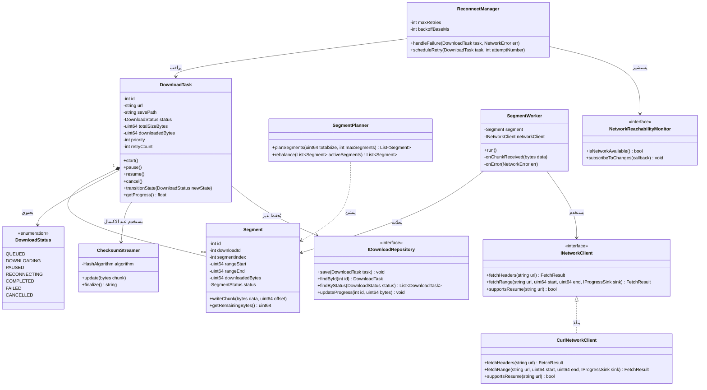
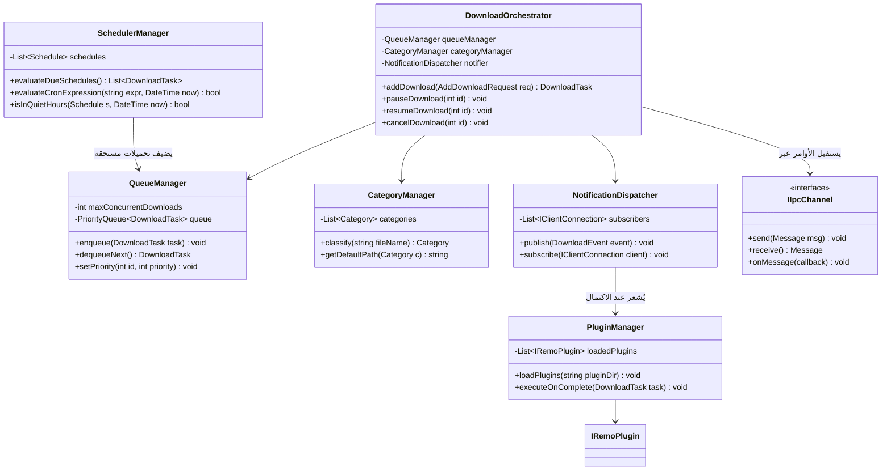
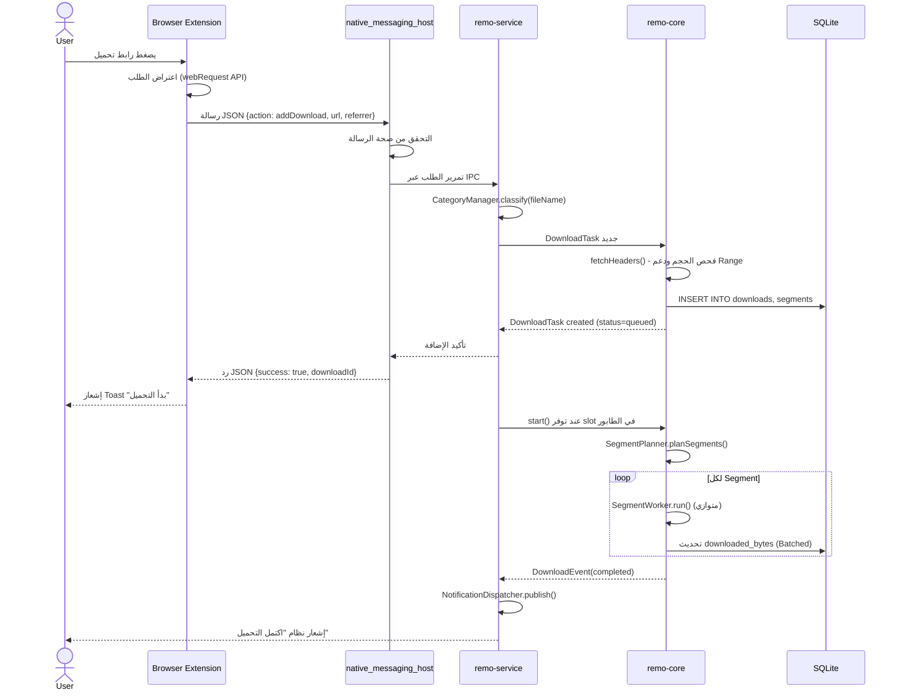
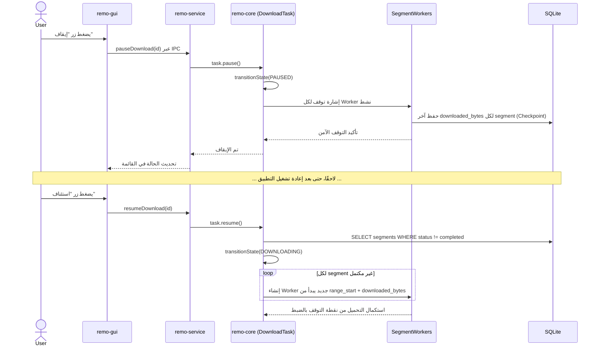
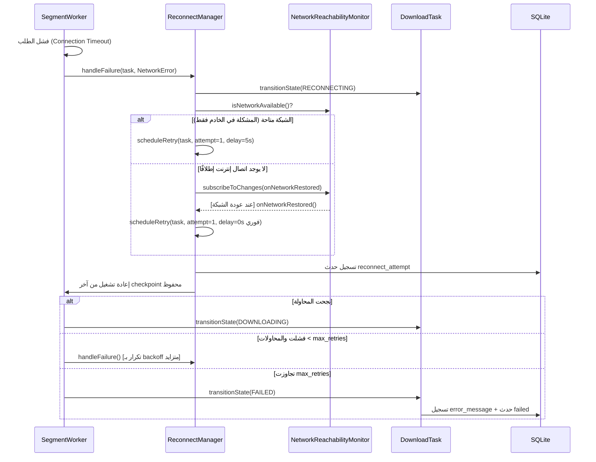
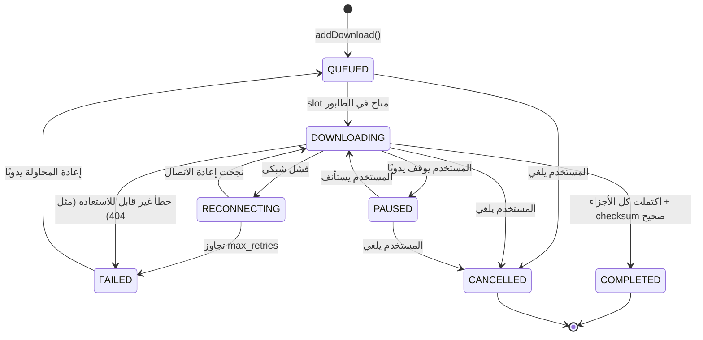
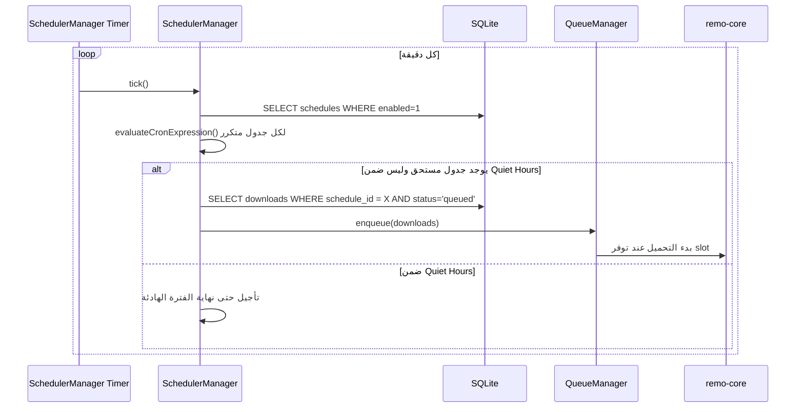
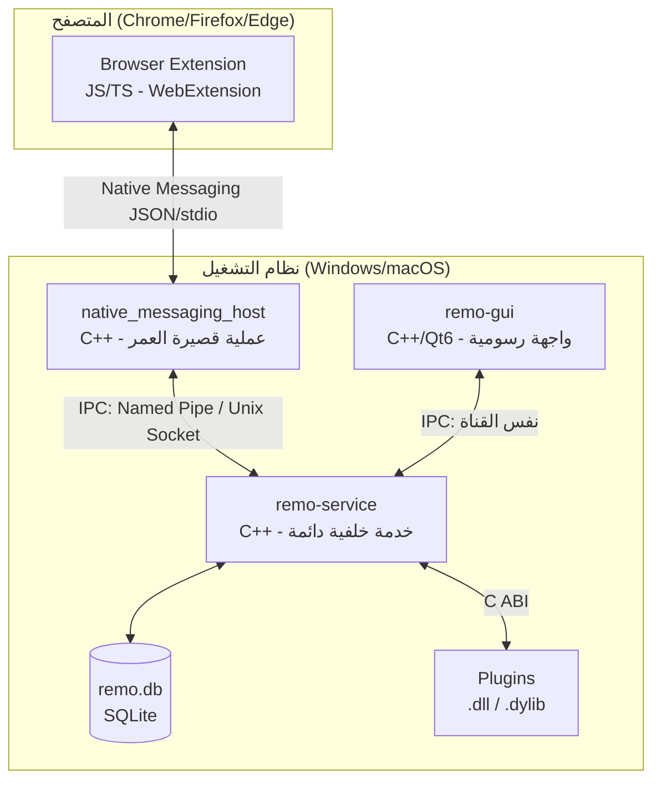

# وثيقة التصميم الهندسي لمشروع Remoo Download
## الفصل 6: مخططات UML (Class & Sequence Diagrams)

**رقم الوثيقة:** SDS-06
**يعتمد على:** SDS-03 (المعمارية), SDS-04 (قاعدة البيانات)
**ملاحظة:** المخططات موثقة بصيغة **Mermaid** (نصية، قابلة للعرض المباشر في GitHub وVS Code وأغلب أدوات التوثيق الحديثة)، لتبقى الوثيقة نصية بالكامل وقابلة لإعادة التوليد والتعديل بسهولة من أي أداة AI أو مطور.

---

## 6.1 مخطط الأصناف: طبقة النواة (remo-core) — Download Engine

---

## 6.2 مخطط الأصناف: طبقة الخدمة (remo-service)

---

## 6.3 مخطط تسلسلي (Sequence Diagram): إضافة تحميل من المتصفح

يوضح تدفق البيانات الكامل الموصوف نصيًا في SDS-03 §3.10.

---

## 6.4 مخطط تسلسلي: الإيقاف والاستئناف (Pause/Resume)

---

## 6.5 مخطط تسلسلي: إعادة الاتصال التلقائي عند انقطاع الشبكة

---

## 6.6 مخطط حالة (State Diagram): دورة حياة التحميل

---

## 6.7 مخطط تسلسلي: الجدولة التلقائية (Scheduler Tick)

---

## 6.8 مخطط مكونات (Component Diagram): نظرة عامة على النشر

---

## 6.9 ملاحظات للتنفيذ

- المخططات أعلاه هي **العقد المرجعي (Source of Truth)** لأي مطور أو أداة AI تبني الكود — أي انحراف في التنفيذ عن أسماء الأصناف أو تدفق الرسائل الموضح هنا يجب أن يُوثّق كتحديث لهذا الفصل أولًا قبل أو بالتوازي مع تعديل الكود.
- عند تنفيذ `DownloadOrchestrator` و`QueueManager` و`SchedulerManager` بالفعل في C++، الأسماء والتوقيعات (Signatures) هنا هي نقطة انطلاق مقترحة قابلة للتفصيل الإضافي وقت كتابة الكود الفعلي (مثل إضافة معالجة استثناءات، أو تفصيل أنواع المعاملات الدقيقة)، لكن **المسؤوليات المعمارية لكل صنف يجب ألا تتغير** دون مراجعة هذا الفصل.
